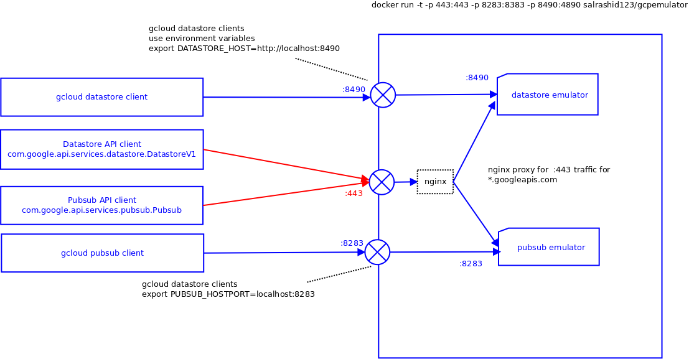

# gcpemulator
Proxy container for Google Cloud Platofrm pubsub and datastore emulators.


Also see
* [docker.io/salrashid123/gcpemulator](https://hub.docker.com/r/salrashid123/gcpemulator/)
* [https://github.com/SaMnCo/docker-pubsub-emulator](https://github.com/SaMnCo/docker-pubsub-emulator)
* [Google gcloud emulators](https://cloud.google.com/sdk/gcloud/reference/beta/emulators/)
* [gcloud-python](https://github.com/GoogleCloudPlatform/gcloud-python)
* [Google PubSub Libraries](https://cloud.google.com/pubsub/libraries)
* [Google Cloud Datastore Libraries](https://cloud.google.com/datastore/docs/getstarted/start_java/)
* [Cloud Datastore Local Development Server](https://cloud.google.com/datastore/docs/tools/devserver#connecting_your_app_to_the_local_development_server)

## Overview
Proxy server and container for GCP Cloud PubSub and Cloud Datastore emulators.  In addition, the container runs an nginx HTTPS proxy infront of the PubSub|Datastore emulators so that even direct references to pubsub.googleapis.com:443 and datastore.googleapis.com:443 are redirected to the respective emulator.  

There are two modes you can use this:  
*  A container running `gcloud emulators <pubsub|datastore>`.  You can use this mode to test your code built with [gcloud-* libraries](http://googlecloudplatform.github.io/gcloud-java/0.2.3/index.html)
*  A container running these emulators but one that accepts traffic intended for (pubsub|datastore).googleapis.com:443.  In this mode, you can even use generic, non-gcloud libraries with this api.  For example.  you can use this with Pubsub ([com.google.api.services.pubsub](https://developers.google.com/resources/api-libraries/documentation/pubsub/v1/java/latest/)) and Datastore ([com.google.api.services.datastore](https://cloud.google.com/datastore/docs/apis/javadoc/com/google/api/services/datastore/client/package-summary))

The second mode requires some significant retooling and reconfiguration on your host laptop/system (i.,e you need access to redirect DNS/hosts, install a trust chain for a CA ([CA_cert.pem](dockerimage/html/CA_crt.pem))  that issued a cert for CN=*.googleapis.com which already resides inside the container ([goog_cert.pem](dockerimage/certs/goog_crt.pem)).




####Usage
To use, you need to
*  Change the DNS or /etc/hosts file to point pubsub.googleapis.com (and if using SSL proxy for datastore, www.googleapis.com)
*  Install the [CA_crt.pem](dockerimage/html/CA_crt.pem) to
** Java cacerts
** Python httplib cacerts.txt
** System (not recommended as you are overriding your system's trust store; most companies would frown on this)


**NOTE**  The proxy sends authentication headers to the proxy.  If you do not want to transmit the auth headers, you can override the access_token field before the API call.

```
sudo docker run -t -p 443:443 -p 8283:8283 -p 8490:8490 salrashid123/gcpemulator
```

You can also build the docker image from scratch instead of using prebuild *salrashid123/gcpemulator*

 
###DNS
Update DNS resolution for pubsub.googleapis.com and datastore.googleapis.com

```
/etc/hosts
127.0.0.1  pubsub.googleapis.com datastore.googleapis.com

/etc/init.d/nscd restart
```


###JAVA

For java, you need to update the cacerts file used by the JRE (default password is 'changeit')

```
$JDK_HOME/jre/lib/security
keytool -keystore cacerts -importcert -alias testeso -file /tmp/CA_crt.crt

keytool -list -keystore cacerts
testeso, Feb 1, 2016, trustedCertEntry, 
Certificate fingerprint (SHA1): 32:DD:B7:7D:7C:5E:D3:93:22:2F:C4:44:B3:5D:28:E9:41:A8:96:2C
```

Then to run
```
cd gcpemulator/java
mvn install
mvn exec:java
```

###PYTHON

```
cd gcpemulator/py
virtualenv gcd
source gcd/bin/activate
pip install -r requirements.txt
```

Now you need to add the CA_cert.pem to the trust store for the local virtualenv httplib2 (used by google api client library). 

gcd/local/lib/python2.7/site-packages/httplib2/cacerts.txt

```
awk 'FNR==1{print ""}1' gcd/local/lib/python2.7/site-packages/httplib2/cacerts.txt ../dockerimage/html/CA_crt.pem > /tmp/cacerts.txt  && cp /tmp/cacerts.txt gcd/local/lib/python2.7/site-packages/httplib2/cacerts.txt
```

Then to run
```
python pubsubclient.py
python clouddatastoreclient.py
```

####CURL

To add the certifiate to the system truststore:
on debian:

```
cd /usr/share/ca-certificates/extra
cp /tmp/CA_crt.pem CA_crt.crt
dpkg-reconfigure ca-certificates
```

After this, you can use curl directly without cert warnings:
``` 
curl  -X PUT  https://pubsub.googleapis.com/v1/projects/p0/topics/t0

curl  -X GET  https://pubsub.googleapis.com/v1/projects/p0/topics
{
    "topics": [
        {
            "name": "projects/p0/topics/t0"
        }
    ]
}


```

### Sample output
```
sudo docker run -t -p  443:443 -p 8283:8283 -p 8490:8490 salrashid123/gcpemulator

2016-02-15 21:42:01,969 CRIT Supervisor running as root (no user in config file)
2016-02-15 21:42:01,969 WARN Included extra file "/etc/supervisor/conf.d/supervisord.conf" during parsing
2016-02-15 21:42:01,988 INFO RPC interface 'supervisor' initialized
2016-02-15 21:42:01,988 CRIT Server 'unix_http_server' running without any HTTP authentication checking
2016-02-15 21:42:01,989 INFO supervisord started with pid 1
2016-02-15 21:42:02,992 INFO spawned: 'nginx' with pid 7
2016-02-15 21:42:02,994 INFO spawned: 'datastore' with pid 8
2016-02-15 21:42:02,998 INFO spawned: 'pubsub' with pid 9
2016-02-15 21:42:03,993 INFO success: nginx entered RUNNING state, process has stayed up for > than 1 seconds (startsecs)
2016-02-15 21:42:03,993 INFO success: datastore entered RUNNING state, process has stayed up for > than 1 seconds (startsecs)
2016-02-15 21:42:04,175 INFO success: pubsub entered RUNNING state, process has stayed up for > than 1 seconds (startsecs)
```